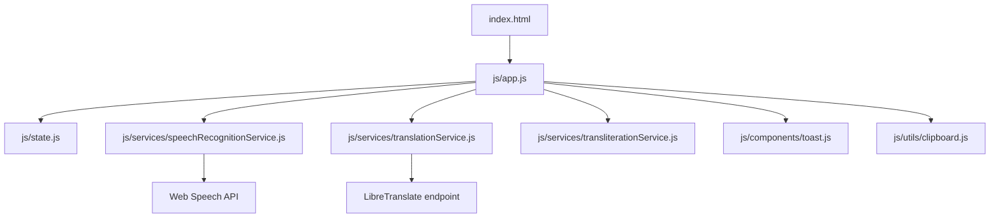
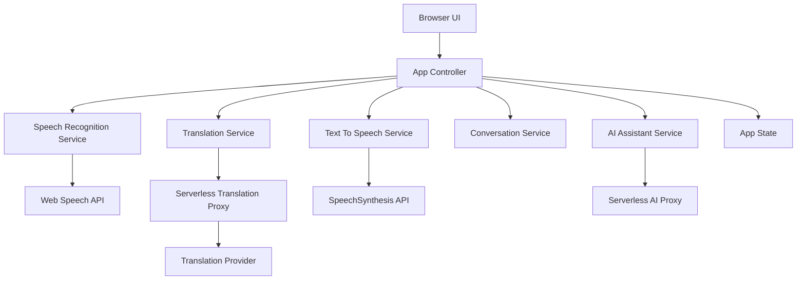

# AI Voice Translator Roadmap

This roadmap is the implementation playbook for a solo developer or another AI coding agent. Each phase must end with a working app.

## Phase Overview

| Phase | Goal | Working Result | Estimate | Priority |
|---|---|---|---:|---|
| 1 | English speech to Thai text | Record English speech until Stop and display Thai translation | Done | High |
| 2 | Text-to-speech | Speak translated text aloud | Done | High |
| 3 | Thai and English two-way mode | Swap English and Thai translation direction | Done | High |
| 4 | Multi-language support | Select and translate across 10 languages | 2-3 days | High |
| 5 | Real-time translation | Continuous listening with low-latency translation | 3-5 days | High |
| 6 | Conversation mode | Two people alternate translated speech turns | 3-5 days | High |
| 7 | AI assistant mode | Speak to an AI assistant through translation | 3-5 days | Medium |

## Current Architecture



## Target Architecture



## Phase 1 Checklist: MVP

Status: complete.

### Goal

English speech to Thai text.

### Delivered Files

```text
index.html
css/base.css
css/theme.css
css/layout.css
css/components.css
css/responsive.css
js/app.js
js/config.js
js/constants.js
js/state.js
js/components/toast.js
js/services/speechRecognitionService.js
js/services/translationService.js
js/utils/clipboard.js
js/utils/dom.js
docs/phase-1.md
tests/manual-test-plan.md
```

### Development Checklist

- [x] Create scalable folder structure.
- [x] Build responsive dark UI.
- [x] Add record and stop controls.
- [x] Keep listening after Start until Stop is pressed.
- [x] Show immediate feedback when no speech is detected.
- [x] Detect Web Speech API support.
- [x] Set speech recognition to `en-US`.
- [x] Display recognized English text.
- [x] Append new recognized phrases like subtitle lines.
- [x] Remove older subtitle lines as new translations arrive.
- [x] Translate English text to Thai.
- [x] Try provider fallback before reporting a translation failure.
- [x] Display Thai translation.
- [ ] Show Thai transliteration when translation fails (deferred; current UI reports the error).
- [x] Add copy button.
- [x] Add clear button.
- [x] Add loading and status states.
- [x] Add toast notifications.
- [x] Add configurable LibreTranslate endpoint.
- [x] Add optional API key field.
- [x] Add README.
- [x] Add manual test plan.

### Testing Checklist

- [x] JavaScript syntax check passes.
- [x] Static server returns `200`.
- [x] App files are served correctly.
- [x] Default translation endpoint responds.
- [ ] Test microphone permission in Chrome.
- [ ] Test microphone permission in Edge.
- [ ] Test continuous listening until Stop.
- [ ] Test subtitle-style new-line feed.
- [ ] Test rolling subtitle cleanup.
- [ ] Test no-speech feedback while listening continues.
- [x] Test translation failure reports an error instead of showing transliteration.
- [ ] Test bad primary provider still returns a usable Thai translation through fallback provider.
- [ ] Test copy button manually.
- [ ] Test mobile layout manually.

### Risks

| Risk | Impact | Mitigation |
|---|---|---|
| Browser speech recognition support varies | High | Show unsupported browser notice |
| Public translation mirror may rate-limit | Medium | Keep endpoint configurable |
| Microphone permission can be denied | Medium | Show actionable error toast |

## Phase 2 Checklist: Text-to-Speech

Status: complete.

### Goal

After translation, let the user hear the Thai translation.

### Working Result

The app can record English until Stop is pressed, translate to Thai, and speak the Thai text aloud.
If translation fails, the app reports the error instead of presenting transliteration as a translation.
The app tries provider fallback before reporting a translation failure.
Recognized and translated phrases appear as subtitle-style lines while listening continues.
Older subtitle lines are removed as new translations arrive.

### Files To Add

```text
js/services/textToSpeechService.js
js/data/voices.js
```

### Files To Update

```text
index.html
js/app.js
js/state.js
css/components.css
css/layout.css
tests/manual-test-plan.md
```

### Development Plan

1. Add a text-to-speech service wrapping `window.speechSynthesis`.
2. Add speak, pause, resume, and stop controls.
3. Add an auto-speak toggle.
4. Load available voices after `voiceschanged`.
5. Prefer Thai voices for Thai output.
6. Disable playback controls when there is no translated text.
7. Stop speaking when the user clears the app.

### Development Checklist

- [x] Create `textToSpeechService.js`.
- [x] Add `isTextToSpeechSupported()`.
- [x] Add `loadVoices()`.
- [x] Add preferred voice lookup.
- [x] Add `speakText()`.
- [x] Add `pauseSpeech()`.
- [x] Add `resumeSpeech()`.
- [x] Add `stopSpeech()`.
- [x] Add voice state to `state.js`.
- [x] Add auto-speak state to `state.js`.
- [x] Add playback buttons to `index.html`.
- [x] Add auto-speak toggle to `index.html`.
- [x] Add voice selector to `index.html`.
- [x] Add voice refresh button for Chrome voice loading.
- [x] Wire controls in `app.js`.
- [x] Speak translated text automatically when auto-speak is enabled.
- [x] Stop current speech before starting a new recording.
- [x] Keep speech recognition running until Stop is pressed.
- [x] Append new recognized and translated phrases like subtitle lines.
- [x] Remove older subtitle lines as new translations arrive.
- [x] Show immediate feedback when no speech is detected.
- [x] Try provider fallback before reporting a translation failure.
- [ ] Keep Thai transliteration available when translation fails (deferred).
- [x] Show toast when no matching voice is found.

### Testing Checklist

- [ ] Speak button reads Thai translation.
- [ ] Auto speak runs after translation.
- [ ] Pause button pauses speech.
- [ ] Resume button resumes speech.
- [ ] Stop button stops speech.
- [ ] Clear button stops speech and resets text.
- [ ] Voice selector updates selected voice.
- [ ] Refresh voices button repopulates voices in Chrome when available.
- [ ] App does not crash if no Thai voice exists.
- [ ] Controls remain keyboard accessible.
- [ ] Start keeps listening across multiple phrases until Stop.
- [ ] New phrases appear as subtitle-style lines.
- [ ] Older subtitle lines are removed as new translations arrive.
- [ ] No-speech feedback appears without stopping listening.
- [x] Failed translation displays an error instead of an empty or misleading result.
- [ ] Bad primary provider still returns a usable Thai translation through fallback provider.

### Risks

| Risk | Impact | Mitigation |
|---|---|---|
| Browser voices load asynchronously | Medium | Listen for `voiceschanged` |
| Thai voice may not exist on device | Medium | Fallback to default voice |
| Speech queue can overlap | Medium | Cancel before speaking new text |

## Phase 3 Checklist: Thai-English Two-Way Translation

Status: complete.

### Goal

Support both English to Thai and Thai to English.

### Working Result

The user can choose direction, swap languages, speak either English or Thai, and hear or read the translated result.

### Files To Add

```text
js/components/languageSelector.js
js/data/languages.js
```

### Files To Update

```text
index.html
js/app.js
js/state.js
js/services/speechRecognitionService.js
js/services/translationService.js
js/services/textToSpeechService.js
css/components.css
tests/manual-test-plan.md
```

### Development Plan

1. Add a language data file for English and Thai.
2. Replace hard-coded labels with selected source and target names.
3. Add source and target selectors.
4. Add a swap button.
5. Update speech recognition language dynamically.
6. Update translation source and target dynamically.
7. Update TTS language dynamically.

### Development Checklist

- [x] Create `languages.js` with English and Thai.
- [x] Add source language selector.
- [x] Add target language selector.
- [x] Add swap button.
- [x] Prevent source and target from matching.
- [x] Update source language in state.
- [x] Update target language in state.
- [x] Map `en` to `en-US` for speech recognition.
- [x] Map `th` to `th-TH` for speech recognition.
- [x] Update panel titles dynamically.
- [x] Update copy button text dynamically.
- [x] Update TTS target language dynamically.
- [x] Clear current transcript after language swap.

### Testing Checklist

- [ ] English to Thai still works in a supported browser.
- [ ] Thai to English works where browser supports Thai recognition.
- [ ] Swap button switches languages.
- [ ] Selectors cannot choose identical languages.
- [ ] Copy button copies the target text.
- [ ] TTS speaks target language.
- [ ] Clear resets current text but keeps selected languages.

### Risks

| Risk | Impact | Mitigation |
|---|---|---|
| Thai recognition may be unsupported | High | Show warning and allow text fallback later |
| Dynamic labels can desync | Medium | Render labels from single language config |
| Swap can leave stale text | Low | Clear text on swap |

## Phase 4 Checklist: Multi-Language Support

### Goal

Support 10 languages: English, Thai, Chinese, Japanese, Korean, French, German, Spanish, Vietnamese, and Indonesian.

### Working Result

The user can select any supported source and target language pair.

### Language Config

| Language | Translation Code | Speech Code |
|---|---|---|
| English | `en` | `en-US` |
| Thai | `th` | `th-TH` |
| Chinese | `zh` | `zh-CN` |
| Japanese | `ja` | `ja-JP` |
| Korean | `ko` | `ko-KR` |
| French | `fr` | `fr-FR` |
| German | `de` | `de-DE` |
| Spanish | `es` | `es-ES` |
| Vietnamese | `vi` | `vi-VN` |
| Indonesian | `id` | `id-ID` |

### Development Plan

1. Expand `languages.js` to all supported languages.
2. Generate selectors from config.
3. Filter TTS voices by selected target language.
4. Validate provider support before translation.
5. Add clear user feedback for unsupported speech recognition cases.

### Development Checklist

- [ ] Add all 10 language configs.
- [ ] Render source selector from config.
- [ ] Render target selector from config.
- [ ] Add default language pair.
- [ ] Add language search or grouped selector if UI feels crowded.
- [ ] Update speech recognition language from selected source.
- [ ] Update translation codes from selected pair.
- [ ] Update TTS voice filtering from selected target.
- [ ] Add unsupported speech recognition warning.
- [ ] Add fallback message when target voice is unavailable.
- [ ] Add manual text input fallback if Thai or other recognition is unreliable.

### Testing Checklist

- [ ] Each language appears in both selectors.
- [ ] Same-language translation is blocked.
- [ ] English to each target language works.
- [ ] Each source language can be selected.
- [ ] Unsupported speech recognition is handled gracefully.
- [ ] TTS fallback works without crashing.
- [ ] Mobile selector layout is usable.

### Risks

| Risk | Impact | Mitigation |
|---|---|---|
| Provider may not support every pair | High | Validate response and show provider error |
| Browser STT support varies by language | High | Add manual input fallback |
| Voice list differs by OS | Medium | Add default voice fallback |

## Phase 5 Checklist: Real-Time Translation

### Goal

Add continuous listening and live translation with low latency.

### Working Result

The user can enable real-time mode, speak continuously, and see transcript and translation update as they speak.

### Files To Add

```text
js/utils/debounce.js
js/utils/requestController.js
js/services/realtimeTranslationService.js
```

### Files To Update

```text
index.html
js/app.js
js/state.js
js/services/speechRecognitionService.js
js/services/translationService.js
css/components.css
tests/manual-test-plan.md
```

### Development Plan

1. Add a real-time mode toggle.
2. Enable continuous recognition.
3. Capture interim and final recognition results.
4. Debounce translation requests.
5. Cancel stale translation requests.
6. Show partial transcript separately from final transcript.
7. Stop after silence timeout.

### Development Checklist

- [ ] Add real-time mode toggle.
- [ ] Add continuous recognition option.
- [ ] Enable `interimResults`.
- [ ] Track interim transcript.
- [ ] Track final transcript.
- [ ] Display partial transcript with visual distinction.
- [ ] Add debounce utility.
- [ ] Debounce translation calls.
- [ ] Avoid translating duplicate text.
- [ ] Use `AbortController` for stale translation requests.
- [ ] Add silence timeout.
- [ ] Add low-latency status indicators.
- [ ] Add setting for real-time mode on/off.
- [ ] Prevent auto-speak from speaking every partial result.

### Testing Checklist

- [ ] Continuous listening stays active.
- [ ] Interim transcript appears while speaking.
- [ ] Final transcript persists after pause.
- [ ] Translation updates without excessive API calls.
- [ ] Stale translation responses do not overwrite newer text.
- [ ] Stop button ends continuous listening.
- [ ] Silence timeout stops recording.
- [ ] Real-time mode can be disabled.

### Risks

| Risk | Impact | Mitigation |
|---|---|---|
| Too many API calls | High | Debounce and deduplicate |
| Stale responses overwrite current translation | High | Abort or sequence requests |
| Continuous recognition can stop unexpectedly | Medium | Add restart logic with user control |

## Phase 6 Checklist: Conversation Mode

### Goal

Support two-person turn-based voice translation.

### Working Result

Person A speaks in one language, the app translates and speaks Person B's language, then Person B replies and the app translates back.

### Files To Add

```text
js/components/conversationHistory.js
js/components/modeTabs.js
js/services/conversationService.js
```

### Files To Update

```text
index.html
js/app.js
js/state.js
css/layout.css
css/components.css
tests/manual-test-plan.md
```

### Development Plan

1. Add mode tabs: Translator and Conversation.
2. Add Person A and Person B language selectors.
3. Add speaker turn state.
4. Reuse speech recognition, translation, and TTS services.
5. Store each turn in conversation history.
6. Add clear conversation action.

### Development Checklist

- [ ] Add mode tabs.
- [ ] Add conversation mode layout.
- [ ] Add Person A language selector.
- [ ] Add Person B language selector.
- [ ] Add current speaker indicator.
- [ ] Add record button for current speaker.
- [ ] Translate Person A to Person B.
- [ ] Speak Person B translation.
- [ ] Switch turn after successful translation.
- [ ] Translate Person B to Person A.
- [ ] Speak Person A translation.
- [ ] Add conversation message history.
- [ ] Add timestamps to messages.
- [ ] Add clear conversation button.
- [ ] Add export conversation text option if small effort.

### Testing Checklist

- [ ] Person A turn records and translates.
- [ ] Person B turn records and translates.
- [ ] Turn indicator updates correctly.
- [ ] Conversation history stores both original and translated text.
- [ ] Clear conversation removes history.
- [ ] TTS speaks the translated turn.
- [ ] Switching modes does not lose basic translator functionality.

### Risks

| Risk | Impact | Mitigation |
|---|---|---|
| Turn state can become confusing | Medium | Make current speaker visually obvious |
| TTS can overlap with next recording | Medium | Disable recording while speaking |
| History can grow large | Low | Keep local session history only at first |

## Phase 7 Checklist: AI Assistant Mode

### Goal

Let the user speak in their language, translate input for AI, receive an AI response, translate it back, and speak it aloud.

### Working Result

The user can have a translated voice conversation with an AI assistant.

### Files To Add

```text
js/services/aiService.js
js/components/assistantChat.js
api/assistant.js
api/translate.js
```

### Files To Update

```text
index.html
js/app.js
js/state.js
css/components.css
README.md
tests/manual-test-plan.md
```

### Development Plan

1. Add assistant mode UI.
2. Add a serverless AI endpoint.
3. Translate user speech into the AI working language.
4. Send translated message to AI.
5. Translate AI response back to the user's target language.
6. Speak AI response.
7. Store assistant conversation history.

### Development Checklist

- [ ] Add assistant mode tab.
- [ ] Add assistant chat panel.
- [ ] Add assistant loading state.
- [ ] Add `aiService.js`.
- [ ] Add serverless AI API route.
- [ ] Move API keys out of frontend.
- [ ] Translate user transcript before sending to AI.
- [ ] Send translated prompt to AI.
- [ ] Receive AI response.
- [ ] Translate AI response back to user language.
- [ ] Display original user text.
- [ ] Display translated user text.
- [ ] Display AI response.
- [ ] Speak AI response.
- [ ] Store conversation history.
- [ ] Add clear assistant history button.
- [ ] Add API error handling.

### Testing Checklist

- [ ] User speech becomes text.
- [ ] User text is translated before AI request.
- [ ] AI response is returned.
- [ ] AI response is translated back.
- [ ] AI response is spoken.
- [ ] History persists during the session.
- [ ] API key is not exposed in browser code.
- [ ] Assistant errors show clear messages.

### Risks

| Risk | Impact | Mitigation |
|---|---|---|
| API keys exposed in frontend | High | Use serverless backend |
| Latency becomes high | High | Show staged loading states |
| Translation can change user intent | Medium | Show original and translated text |
| Cost can grow | Medium | Add request limits and shorter context |

## Production Hardening Checklist

- [ ] Add serverless translation proxy.
- [ ] Add serverless AI proxy.
- [ ] Remove frontend API keys.
- [ ] Add provider timeout handling.
- [ ] Add retry policy for transient failures.
- [ ] Add request throttling.
- [ ] Add privacy notice.
- [ ] Add terms of use.
- [ ] Add manual text input fallback.
- [ ] Add editable transcript.
- [ ] Add PWA manifest.
- [ ] Add app icons.
- [ ] Add basic analytics without recording speech content.
- [ ] Add automated UI tests.
- [ ] Add accessibility audit.
- [ ] Add deployment guide for GitHub Pages.
- [ ] Add deployment guide for Netlify or Vercel.

## Recommended Build Order

1. Finish manual QA for Phase 1.
2. Complete Phase 2 TTS.
3. Complete Phase 3 two-way English and Thai.
4. Add Phase 4 multi-language config.
5. Add manual text input fallback before or during Phase 4 if speech support is weak.
6. Add Phase 5 real-time translation after API throttling is understood.
7. Add Phase 6 conversation mode.
8. Add Phase 7 AI assistant only after serverless API infrastructure is in place.
